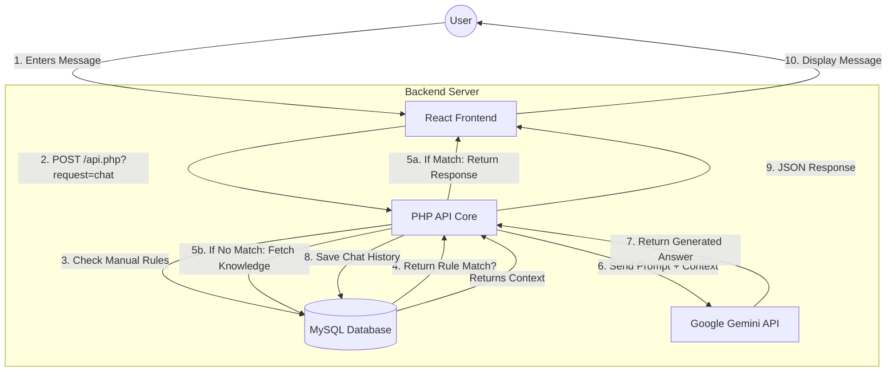

# CCC SmartAssist - Intelligent Student Companion System

Welcome to the **CCC SmartAssist** project documentation. This system is an AI-powered chatbot and student portal designed to assist students of Cainta Catholic College (CCC) with inquiries about enrollment, tuition, scholarships, and general academic information.

<div align="center">
  
</div>

---

## 📋 Table of Contents
1. [System Overview](#-system-overview)
2. [Key Features](#-key-features)
3. [Technical Architecture](#-technical-architecture)
4. [Project Structure](#-project-structure)
5. [Installation & Setup](#-installation--setup)
6. [Usage Guide](#-usage-guide)
7. [System Processes](#-system-processes)
8. [Maintenance & Management](#-maintenance--management)
9. [Production Deployment](#-production-deployment)

---

## 🌐 Production Deployment
For instructions on how to deploy this system to **Vercel** (Frontend) and **Railway** (Backend/Database), please refer to the [**DEPLOYMENT.md**](./DEPLOYMENT.md) guide.

## 🌟 System Overview

**CCC SmartAssist** is a hybrid web application that combines a modern React frontend with a robust PHP/MySQL backend. It uses the **Google Gemini 1.5 Flash** model to provide intelligent, context-aware responses, supplemented by a local Knowledge Base and Manual Rule system for accurate institutional answers.

### Target Users
- **Students:** Inquire about school processes, view requirements, and get instant answers.
- **Administrators:** Manage the chatbot's knowledge, monitor system usage, and configure settings.

---

## 🚀 Key Features

### For Students
- **Real-time Chat Interface:** Smooth, responsive chat UI with typing indicators and optimistic updates.
- **Instant FAQs:** Immediate responses to common questions (Enrollment, Tuition, etc.) without API latency.
- **Persistent History:** Chat sessions are saved and can be revisited or managed (deleted/cleared).
- **Smart Recommendations:** Context-aware suggestions based on user queries.
- **Mobile Responsive:** Fully optimized for mobile devices with a slide-out sidebar.

### For Administrators
- **Dashboard:** comprehensive view of system statistics (KB count, Rule count, Sessions).
- **Knowledge Base Management:** CRUD (Create, Read, Update, Delete) operations for the AI's reference data.
- **Manual Rules Engine:** Define exact keyword triggers and responses to override AI generation.
- **System Settings:** Customize the system name, theme color (Blue/Emerald/Violet), and API Keys directly from the UI.

---

## 🛠 Technical Architecture

The system follows a decoupled Client-Server architecture:

### Frontend (Client)
- **Framework:** React 19 (via Vite)
- **Language:** TypeScript
- **Styling:** Tailwind CSS (custom glassmorphism design)
- **Icons:** Lucide React
- **State Management:** React Hooks (`useState`, `useEffect`, `useRef`)

### Backend (Server)
- **Language:** Native PHP 8.0+
- **Database:** MySQL / MariaDB
- **API Style:** RESTful JSON API (`api.php`)
- **AI Integration:** Google Gemini API (via cURL)

---

## 📂 Project Structure

```
ccc-smartassist/
├── backend/                # Server-side logic
│   ├── api.php             # Main API Endpoint router
│   ├── Core.php            # Business logic class
│   ├── db.php              # Database connection config
│   ├── schema.sql          # Database structure definition
│   └── database...sql      # Full database dump with sample data
├── components/             # React UI Components
│   ├── AdminDashboard.tsx  # Admin interface
│   ├── ChatInterface.tsx   # Main chat view
│   ├── LandingChatWidget.tsx # Floating widget for landing page
│   ├── Sidebar.tsx         # Navigation and History
│   └── Layout.tsx          # Common page layout
├── services/
│   └── apiService.ts       # Frontend API communication layer
├── constants.ts            # System constants & default data
├── App.tsx                 # Main Application Router & State Container
└── index.html              # Entry point
```

---

## ⚡ Installation & Setup

### Prerequisites
1.  **XAMPP** (or any PHP/MySQL environment)
2.  **Node.js** (v18+)

### Step 1: Backend Setup
1.  Start **Apache** and **MySQL** in XAMPP control panel.
2.  Move the project folder to `C:\xampp\htdocs\ccc-smartassist`.
3.  Open `http://localhost/phpmyadmin`.
4.  Create a new database named `ccc_smartassist`.
5.  Import `backend/database with data ready to use.sql` into the created database.
6.  Verify `backend/db.php` credentials (default: user `root`, password empty).

### Step 2: Frontend Setup
1.  Open a terminal in the project directory.
2.  Install dependencies:
    ```bash
    npm install
    ```
3.  Start the development server:
    ```bash
    npm run dev
    ```
4.  Open the link provided (usually `http://localhost:5173`).

---

## 📖 Usage Guide

### Default Credentials
| Role | Username | Password |
|------|----------|----------|
| **Admin** | `admin` | `admin123` |
| **Student** | `student` | `student123` |

2. **Connecting to AI:**
   - Log in as **Admin**.
   - Go to **Settings**.
   - Paste your valid **Google Gemini API Key**.
   - Save changes.

---

## 🔄 System Processes

### Chat Processing Flow
1.  **Input:** User sends a message.
2.  **Local Check:** Frontend checks `Manual Rules` and `Default FAQs` for an exact match. If found -> **Instant Local Response**.
3.  **Server Request:** If no local match, request sent to `api.php`.
4.  **Rule Check:** Backend checks database `manual_rules` for keyword match.
5.  **AI Generation:**
    -   Backend retrieves all `knowledge_base` entries.
    -   Constructs a prompt: System Instruction + Knowledge Context + Chat History + User Message.
    -   Sends to Gemini 1.5 Flash.
6.  **Response:** Result is saved to `messages` table and returned to frontend.

### Authentication
- Passwords for new users are hashed using `BCRYPT`.
- Legacy cleartext passwords (from initial seed) are auto-upgraded to hashes upon first successful login in `api.php`.

---

---

## 📊 Data Flow & Database Design

### 1. Data Flow Diagram (DFD)
The system follows a straightforward meaningful flow from the user interface to the backend processors.



### 2. Database Schema (ERD)
The database `ccc_smartassist` consists of 6 normalized tables designed for performance and integrity.

#### 🗄️ Core Tables

**1. `users`**
*Stores authentication details for Admins and Students.*
| Column | Type | Description |
|--------|------|-------------|
| `id` (PK) | VARCHAR(50) | Unique User ID (e.g., `student-xyz`) |
| `username` | VARCHAR(50) | Unique login name |
| `password` | VARCHAR(255) | Hashed password (BCRYPT) |
| `role` | ENUM | 'student' or 'admin' |
| `full_name`| VARCHAR(100)| Display name |

**2. `chat_sessions`**
*Groups messages into conversation threads.*
| Column | Type | Description |
|--------|------|-------------|
| `id` (PK) | VARCHAR(50) | Unique Session ID |
| `user_id` | VARCHAR(50) | Owner of the session |
| `title` | VARCHAR(255) | Auto-generated title (first 30 chars) |
| `last_updated`| BIGINT | Timestamp for sorting |

**3. `messages`**
*Individual chat bubbles within a session.*
| Column | Type | Description |
|--------|------|-------------|
| `id` (PK) | VARCHAR(50) | Unique Message ID |
| `session_id` (FK)| VARCHAR(50) | Links to `chat_sessions` |
| `role` | VARCHAR(20) | 'user' or 'model' |
| `content` | TEXT | The actual message text |
| `timestamp`| BIGINT | When it was sent |

#### 🧠 Knowledge Tables

**4. `knowledge_base`**
*The "Brain" of the AI. Source material for queries.*
| Column | Type | Description |
|--------|------|-------------|
| `id` (PK) | VARCHAR(50) | Unique ID |
| `question` | TEXT | The topic or trigger question |
| `answer` | TEXT | The detailed information |
| `category` | VARCHAR | e.g., 'admission', 'tuition' |
| `source` | VARCHAR | 'manual' or 'pdf' |

**5. `manual_rules`**
*Hard-coded overrides for exact matches.*
| Column | Type | Description |
|--------|------|-------------|
| `id` (PK) | VARCHAR(50) | Unique ID |
| `keyword` | TEXT | Trigger phrase (e.g., "reset password") |
| `response` | TEXT | Fixed response text |
| `active` | BOOLEAN | Toggle rule on/off |

**6. `settings`**
*System-wide configuration.*
| Column | Type | Description |
|--------|------|-------------|
| `id` (PK) | INT | Single row (ID = 1) |
| `system_name`| VARCHAR | Name displayed in UI header |
| `theme_color`| VARCHAR | UI Theme (blue/emerald/violet) |
| `api_key` | TEXT | Google Gemini API Key |

---

## 🔧 Maintenance & Management

### Database Management
- **Backup:** Regularly export the `ccc_smartassist` database via phpMyAdmin.
- **Restoration:** Import the SQL file to restore state.
- **Cleaning:** To reset the system, truncate `messages` and `chat_sessions` tables.

### Admin Dashboard Tips
- **Knowledge Base:** Keep entries concise. Use the format "Topic" -> "Detailed Content".
- **Rules:** Use specific keywords for rules (e.g., "tuition fee") to prevent them from triggering on generic sentences.
- **Troubleshooting:**
    -   **Offline Mode:** Appears if the backend is unreachable. Check XAMPP Status.
    -   **"System Uplink Failed":** Usually means the API Key is invalid or Quota exceeded.

---

**Developed for Cainta Catholic College**
*Neural Core Active • Educational Assistant System*
